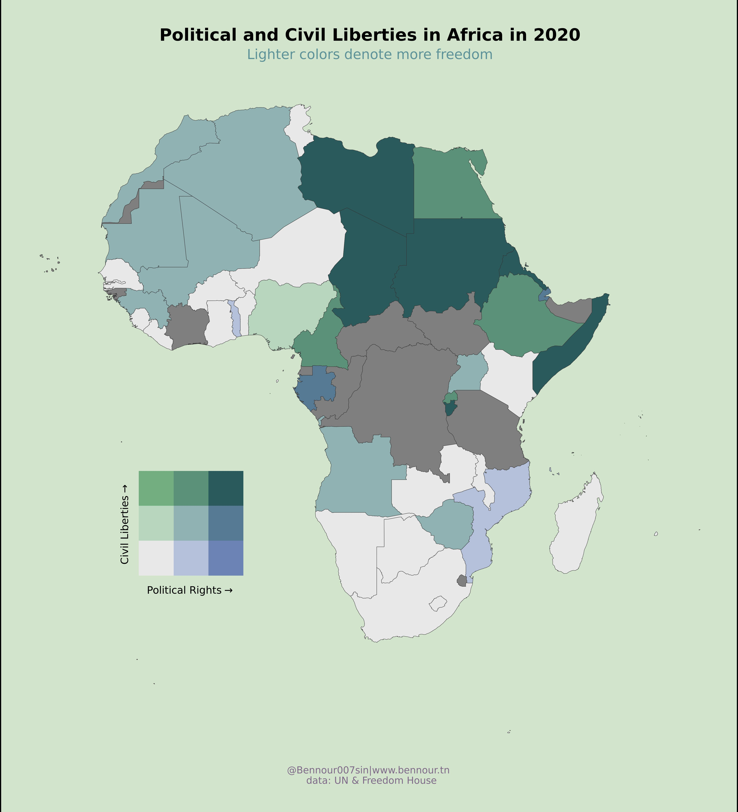

It's 2022, where technology is driving the world with data and information, often times it turns out to be private data, and misinformation. However this unprecedented ease of communication allowed humans to express themselves in more divers and creative ways. But for this expression to grow, thrive, and produce an output freedom is mandatory. 

In this context Freedom house together with the United Nations created a data-set on the state of freedom in the world. As part of the Tidy Tuesday project We will check this data and see what we can come up with. 


## Loading libraries


```{r message=FALSE, warning=FALSE}
library(tidyverse)
# we probably will need GT, sf, and biscale
library(gt)
library(sf)
library(biscale)
```


## Data Summary


Let's first import data (and clean it's column names)

```{r message=FALSE, warning=FALSE}
freedom <- readr::read_csv('https://raw.githubusercontent.com/rfordatascience/tidytuesday/master/data/2022/2022-02-22/freedom.csv') %>% 
  janitor::clean_names()

freedom
```

A quick look at the summary stats

```{r message=FALSE, warning=FALSE}
freedom %>% 
  summary()
```

It might be a little easier if we simply convert the character cols to factors

```{r message=FALSE, warning=FALSE}
freedom %>% 
  mutate(
    country = as_factor(country),
    status = as_factor(status),
    region_name = as_factor(region_name)
    ) %>% 
  summary()
```

Unfortunately we can't get much information using the transformation we did because there are various years for each of the factors, thus in order to get a better idea on the numbers for each factor let's choose one year and filter.

```{r message=FALSE, warning=FALSE}
freedom %>% 
  mutate(
    country = as_factor(country),
    status = as_factor(status),
    region_name = as_factor(region_name)
    ) %>% 
  filter(
    year == 2020
  ) %>% 
  summary()
```

With this simple filter we can see in the summary output how many countries we have in each region as well as the general status (free(F), partially free(PF), and not free(NF)) for all countries. 

Let's check the data time wise 

```{r message=FALSE, warning=FALSE}
freedom %>% 
  count(region_name, year) %>% 
  ggplot()+
  geom_line(
    aes(
      year, 
      n,
      color = region_name
    )
  ) +
  labs(
    title = 'The number of observations(countries) for each region over time'
  )
```

It's probably not the best option to use a line chart to describe slight changes in the data, in our case the number of observation per region. However it's a fast solution to check things out fast, in this case we can detect that for the African and Asian regions there has been an increase in the number of countries in one instance, however for the Europe region this happened twice. I doubt this is going to affect our approach, but let's keep it in mind for further analysis.

## Exploration

The first idea that comes in mind for me is to check how the freedom status for each region changed over the years. But first, you noticed the first chart is quite vanilla, by my standards I would say it lacks aesthetics. Yes I'm doing all this for fun, but it doesn't mean I should compromise on beauty and style. Therefore I will start by setting up a theme that will be used hereafter.

### Le theme

```{r}
le_theme <- theme(
  panel.background = element_rect(
    fill = '#E5E3C9',
    color = NA
  ),
  plot.background = element_rect(
    fill = '#E5E3C9',
    color = NA
  ),
  strip.background = element_rect(
    fill = '#E5E3C9',
    color = NA
  ),
  legend.background = element_rect(
    fill = '#E5E3C9',
    color = NA
  ),
  legend.box.background = element_rect(
    fill = '#E5E3C9',
    color = NA
  ),
  panel.grid.major.x = element_blank(),
  panel.grid.major.y = element_line(
    colour = '#F4FCD9'
  ),
  panel.grid.minor.y = element_blank(),
  panel.grid.minor.x = element_line(
    colour = '#F4FCD9'
  ),
  legend.text = element_text(
    family = 'URWGothic'
  ),
  legend.title = element_text(
    family = 'URWGothic'
  ),
  plot.title = element_text(
    family = 'URWGothic'
  ),
  plot.subtitle = element_text(
    family = 'URWGothic'
  ),
  axis.text = element_text(
    family = 'URWGothic'
  ),
  axis.title = element_text(
    family = 'URWGothic'
  ),
  strip.text = element_text(
    family = 'URWGothic'
  ),
  legend.key = element_rect(colour = NA, fill = NA),
)
```


Another Important Aesthetic addition in my oppinion is the use of a different color palette. I didn't have much time to set my own palettes, but using the [`MetBrewer`](https://github.com/BlakeRMills/MetBrewer) package we can use pre-built palettes inspired from the worlds most famous paintings. It's brilliant package, shout-out to the maintainers.


```{r message=FALSE, warning=FALSE}
freedom %>% 
  group_by(region_name, year, status) %>% 
  summarise(
    status,
    count = n()
  ) %>% 
  ggplot(
    aes(
      year, 
      count
    )
  ) + 
  geom_point(
    aes(
      color = status
    ) , 
    size = 0.6,
    alpha = 0.3
  )+
  geom_line(
    aes(
      color = status
    )
  ) +
  facet_grid(region_name~.) +
  ##############################################################################
  # Using the MetBrewer package to set the palettes manually for the color scales.
  scale_color_manual(
    values= MetBrewer::met.brewer("VanGogh2", 3)
  ) +
  ##############################################################################
  labs(
    title = 'Count of countries per status and region from 1995 to 2020'
  ) + 
  le_theme
```

I like aggregation, it gives general tendencies and ease up investigation. What if we look at the global aggregate of the status over the years.

```{r message=FALSE, warning=FALSE}
freedom %>% 
  group_by(status, year) %>% 
  summarise(
    count = n()
  ) %>% 
  ggplot() + 
  geom_line(
    aes(
      year,
      count,
      color = status
    )
  ) +
  scale_color_manual(
    values= MetBrewer::met.brewer("VanGogh2", 3)
  ) +
  labs(
    title = 'Number of countries per status between 1995 and 2020'
  ) + 
  le_theme

```

At the aggregate level, we can observe that the difference between 1995 and 2020 in the number of free countries is positive, however also the difference in the number of non free country in the period is positive, wile the less countries are partially free in 2020 compared to 1995.

Let's dig deep on the changes, this a great use case for the `gt` package.


```{r message=FALSE, warning=FALSE}
freedom %>% 
  group_by(status, year) %>% 
  summarise(
    count = n()
  ) %>% 
  filter(
    year %in% c(1995,2020)
  ) %>% 
  pivot_wider(
    names_from = year,
    values_from = count
  ) %>% 
  mutate(
    difference = `2020` - `1995`,
    percentage = difference / `2020`
  ) %>% 
  ungroup() %>% 
  gt() %>% 
  fmt_percent(
    columns = percentage
  ) %>% 
  cols_align(
    columns = c(percentage, difference),
    align = 'right'
  ) %>% 
  # add black thick border to the left of the difference column 
  tab_style(
    style = list(
      cell_borders(
        sides = 'left',
        color = 'black', 
        weight = px(3)
      )
    ),
    locations = list(
      cells_body(
        columns = difference
      )
    )
  ) %>% 
  # add black thick border to the bottom of the column names
  tab_style(
    style = list(
      cell_borders(
        sides = 'bottom',
        color = 'black', 
        weight = px(3)
      )
    ),
    locations = list(
      cells_column_labels(
        columns = everything()
      )
    )
  ) %>% 
  data_color(
    columns = difference,
    colors = scales::col_numeric(
      palette = as.character(paletteer::paletteer_d("ggsci::red_material", n = 3)),
      domain = NULL
    )
  ) %>% 
  data_color(
    columns = percentage,
    colors = scales::col_numeric(
      palette = as.character(paletteer::paletteer_d("nord::frost")),
      domain = NULL
    )
  ) %>% 
  tab_header(
    title = 'Global difference in Status between 1995 and 2020',
    subtitle = 'Is the world more free in 2020 than in 1995?'
  ) %>% 
  tab_source_note(
    '@Bennour007sin|www.bennour.tn'
  ) %>% 
  tab_source_note(
    'data: UN & Freedom House'
  )
  
```

Digging deeper to check for the relative changes in the general status between 1995 and 2020 for each continent is an interesting idea after reviewing these status in the global context. For this one I decided to fo something different and make an interactive chart using `ggplotly()`.

```{r message=FALSE, warning=FALSE}
plt <- freedom %>% 
  group_by(region_name, status, year) %>% 
  summarise(
    count = n()
  ) %>% 
  filter(
    year %in% c(1995,2020)
  ) %>% 
  mutate(
    year = as_factor(year)
  ) %>% 
  ungroup(status, year) %>% 
  pivot_wider(
    names_from = year, 
    values_from = count
  ) %>% 
  mutate(
    pct_change = (`1995` - `2020`) / `2020`
  ) %>% 
  pivot_longer(
    cols = 3:4,
    names_to = 'year',
    values_to = 'count'
  ) %>% 
  ggplot(
    aes(
      pct_change,
      status
    )
  )+
  geom_col(
    aes(
      count,
      status, 
      fill = year
    ), 
    width = 0.09,
    alpha = 0.7,
    position = 'dodge'
  ) +
  geom_point(
    aes(
      pct_change,
      status
    ),
    shape = 18,
    color = '#A68DAD',
    size = 4
  ) + 
  scale_x_continuous(
    labels = scales::percent_format(
      accuracy = 1, 
      scale = 1
    )
  ) + 
  scale_fill_manual(
    values= MetBrewer::met.brewer("VanGogh2", 2)
  ) +
  facet_grid(~region_name, scales = 'free_x') +
  labs(
    title = 'Number of countries and percentage of change in each status in 1995 and 2020 per region'
  ) + 
  le_theme

plotly::ggplotly(plt)
```

The users can hoover on the components of the chart and check the difference on the spot. But somehow this is not rendering in the right manner, if anyone can help please reach out.

## Liberties : Political and Civil

What is the state of Civil and Political liberties over the continents 

```{r message=FALSE, warning=FALSE}
freedom %>% 
  group_by(region_name) %>% 
  summarise(
    avg_CL = mean(cl),
    avg_PR = mean(pr),
    avg_L = (avg_CL + avg_PR)/2
  ) %>% 
  pivot_longer(
    cols = 2:3,
    names_to = 'index',
    values_to = 'value'
  ) %>% 
  mutate(
    region_name = fct_reorder(region_name, avg_L, .desc = T)
  ) %>% 
  ggplot()+
  geom_col(
    aes(
      value,
      region_name,
      fill = index
    ),
    position = 'dodge'
  ) +
  geom_point(
    aes(
      avg_L,
      region_name
    ),
    shape = 18,
    size = 10,
    color = '#A68DAD'
  ) + 
  labs(
    title = 'Overall year/region mean of Civil and Political liberties', 
    subtitle = 'less is better, and Europe is the Freeiest region in the world',
    y = 'Region'
  ) +
  scale_fill_manual(
    values= MetBrewer::met.brewer("VanGogh2", 2), 
    name = 'Average Liberty',
    labels = c('Civil', 'Political')
  ) + 
  le_theme
  

```

As an African I'm usually curious in investigating data regarding my region, this time I was inspirded by CÉDRIC SCHERER's Visualisation of the Malaria Data from the WHO. 

You can check his code [here](https://github.com/z3tt/TidyTuesday/blob/master/R/2018_33_Malaria.Rmd) and the chart itself [here](https://raw.githubusercontent.com/Z3tt/TidyTuesday/master/plots/2018_33/2018_33_MalariaDeaths.png).

The reason I appreciated this chart was the Artist's use of bi-scale legend to denote the dispurtion of the Malaria virus. In our case it can be ver useful to apply the same principle to make a bi-scale for the civil and political liberty at the same time on the same chart.

Making a 2-dimensional legend scale is made possible by the [`biscale` package](https://slu-opengis.github.io/biscale/articles/biscale.html) which is what we will make below.


## Le map

To make this map we need to get geometric data of the African continent, this possible with the `sf` package. 

```{r message=FALSE, warning=FALSE}
africa_map_data <- st_as_sf(
  rworldmap::getMap(resolution = 'high')
  ) %>% 
  filter(
    continent == 'Africa'
  ) 
```

Once the geometric data is ready, we must create our main data, the one we will use to make the map itself. i.e: We will need to join the freedom data with the geometric data. 
At the same time we will need to let `ggplot` know that we will be using bi-dimensional scales by using the `bi_class()` and the `bi_scale_fill()` functions. 

In the `bi_class()` function we set up the the dimensions we will use to create our new scale, in our case those are the political right and civil liberty variables. We need to also make the fill mapping `geom_sf` assigned to `bi_class`, and we also need to set a palette theme in the `bi_scale_fill`.

Shout-out to the maintainers of this package for the great documentation and for Cedric for his constant sharing of his art, it definitely helps.

```{r message=FALSE, warning=FALSE}
africa_map <- africa_map_data %>%
  left_join(
    freedom %>% 
      filter(year == 2020), 
    by = c("NAME"="country")
  ) %>% 
  bi_class(
    x = pr, 
    y = cl, 
    dim= 3, 
    style = 'quantile'
  ) %>% 
  ggplot() +
  geom_sf(
    aes(
      fill = bi_class
    ),
    color = "grey20",
    lwd = 0.2,
    show.legend = F
  ) + 
  bi_scale_fill(
    pal = "DkCyan", 
    dim = 3
  )+ 
  labs(
    title = 'Political and Civil Liberties in Africa in 2020',
    subtitle = 'Lighter colors denote more freedom',
    caption = "@Bennour007sin|www.bennour.tn \n data: UN & Freedom House"
  ) 
```


All what is left for us to do is set up the legend itself to help the readers navigate the map, we do that by determining the extent of the legend, in our case we will use a 3x3 map. We will also need to set up the palette theme it must be the same as the map theme of course. Lastly we set up the labs for the legend, the background color, the size, and the fonts, then we should be ready to combine all of this in one chart. 

```{r message=FALSE, warning=FALSE}
africa_map_legend <- bi_legend(
  pal = "DkCyan",
  dim = 3,
  xlab = "Political Rights",
  ylab = "Civil Liberties"
) + 
  bi_theme(
    bg_color = "#D3E4CD",
    base_family = "Changa One",
    base_size = 15
  )
```

Finaly we use  the `cowplot` package to combine both the map and the legend and we end up with both the map and the legend together. We will use a different theme so everything look better before we render.  


```{r message=FALSE, warning=FALSE}
le_theme_map <- theme(
  axis.ticks = element_blank(),
  axis.text = element_blank(),
  panel.grid.major = element_blank(),
  panel.grid.minor = element_blank(),
  panel.background = element_rect(color = NA, 
                                  fill = "#D3E4CD"),
  plot.background = element_rect(color = NA, 
                                 fill = "#D3E4CD",
                                 size = 5),
  plot.title = element_text(family = "Changa One", 
                            color = "black",
                            size = 25, 
                            face = "bold",
                            hjust = 0.5,
                            margin = margin(t = 36, b = 6)),
  plot.subtitle = element_text(family = "Changa One", 
                               color = "#5F939A",
                               size = 20, 
                               hjust = 0.5,
                               margin = margin(t = 6, b = 20)),
  plot.caption = element_text(family = "Changa One", 
                              color = "#806A8A", 
                              size = 14, 
                              face = "plain",
                              hjust = 0.5,
                              margin = margin(t = 0, b = 36))
)

```


```{r message=FALSE, warning=FALSE}
africa_map_final <- cowplot::ggdraw() +
  cowplot::draw_plot(africa_map + le_theme, 0, 0, 1, 1) +
  cowplot::draw_plot(africa_map_legend, 0.15, 0.25, 0.2, 0.2)

```



Cheers!
