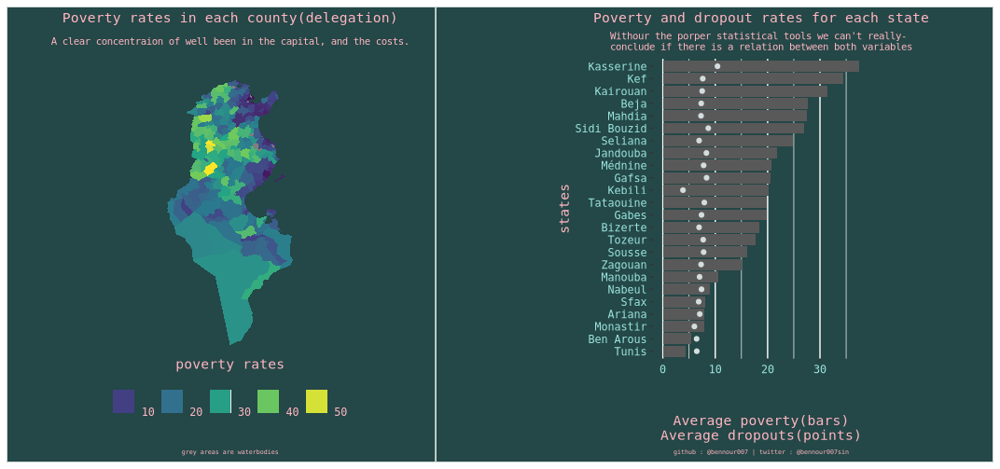

The INS(L'Institut National de la Statistique; i.e the national institute of statistics) is the government body in Tunisia responsible of conducting surveys, collect, and centralize data. With whatever means the state currently have(if you don't know, Tunisia is on the brink of bankruptcy) the INS is doing its best to provide, some how, meaningful statistics for the government and the public. This data is a mine of gold for a nerd like me, and I intend to mine it every time I find the time to do so.

Frankly in the context of the chaotic situation that Tunisia is undergoing, open data is not a hot subject. However, my angle is different as the problem in Tunisia is mainly political and needs deep and bald reforms in order to bring **law and order** to the country. However politicians, and the state itself do not have an idea on the status quo because information is not centralized but rather decentralized in different administrations and ministries.

From this darkness arises the INS, and publish public reports on a quarterly basis  using public and privately collected data. As an example, Lately the INS published an important report on the state of poverty in Tunisia. They used data from the consumption survey they conducted in 2015, and data from the ministry of education.

I wanted to play with the data and see what I can find myself, but initially that wasn't possible as this data was published in tables in a PDF format, thus I needed to extract this data and convert it into a manageable format. You can find the code in [my repo here](https://github.com/bennour007/poverty). 

I have had a similar experience with extracting tables from pdf files before, but it was overwhelmingly on a larger scale than this time. The election replication project was indeed very interesting in this regard, and it basically layed the foundations of my comfort with R (and Python), and with dealing with all sorts of structured data. You can check the post I wrote about it [here](https://www.bennour.xyz/project/elections/).

I hope this effort will help researchers and curious minds to actually evaluate the work done by the INS, and use the data to make more interesting empirical research. 

Finally I found some time to actually learn shiny and make the app. You can see it below, or [here](https://bennour-med-hsin.shinyapps.io/poverty_dash/).

<iframe height="800" width="100%" margin-left=yes frameborder="no" src="https://bennour-med-hsin.shinyapps.io/poverty_dash/">
</iframe>

Well, it works on the my website now. Unfortunately my poor knowledge of web development didn't allow me to actually take advantage of the full space in the page, but as a first trial I don't think its bad, you can visit the deployed version in this [link](https://bennour-med-hsin.shinyapps.io/poverty_dash/).
Now let's talk about this app a little, nothing technical, just some basic ideas, but if you want to see the code you can visit [my repo here](https://github.com/bennour007/poverty_dash) (again, pull requests are welcomed.)

## What does ths app do?

This app was designed using the data that I have already collected, cleaned and stored in my machine. I wrote a small word on it, but I didn't really discuss any kind of insights since its a work in progress. 

Now about what it does, it simply shows the data from each state. The user chooses the state name on the left, and the app provides more details on the poverty rate and the dropout rate for each county in that state. on the left the averages are provided, and the plot in top is simply the poverty rate plotted against the dropout rate for each county in the chosen state. 

## What this app does not do?

This app was intended to provide a geographical visualization of the data provided already. But since no body is perfect, I didn't really focus enough on getting it done the way I originally intended. Essentially this data is basically a way to let curious minds know that I got some interesting data (LOL?). Also this app wasn't made with statistical sophistication in mind. the plot in top isn't supposed to provide any kind of statistical insights, and frankly the geom_smooth() function makes it really cool.

## What are the components of this app?

This app uses data on the dropout rate and poverty rates for each state, the columns are: 

  * county: The names of the counties of the selected state.
  
  * dropout_rate_primary: The dropout rate from primary schools. 
  
  * dropout_rate_secondary: The dropout rate from secondary schools(high schools).
  
  * dropout_rate_ps: The dropout rate of both primary and secondary schools.
  
  * poverty: The poverty rate of each county.
  
  * state: Is basically the chosen state, this column isn't supposed to show up to the user, its just me trying to make my data tidy in the backend.

## Long live ggplot2!

I couldn't simply stop with the shiny app, though it needs some updates, but I figured to make a plot that summarizes(dplyr ehm ehm!) the entire data. 

During this process I discovered some really nice features in ggplot2 with which I made this plot. It simply provides a map of Tunisian counties(we call them delegations) with the corresponding poverty rates provided by the INS. It also provides a state wise comparison of the respective averaged poverty rated and averaged dropout rates.  

  
That's basically all I got to say, Looking forward for feedbacks. 

I will keep this post updated.

Thank you for stopping by.

